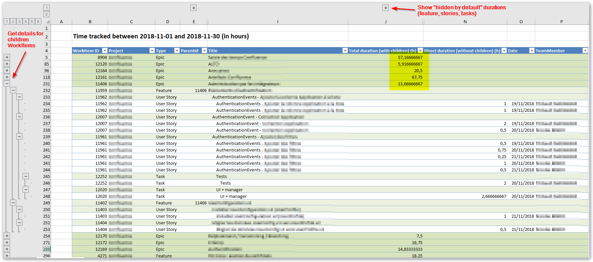

TimetrackerExcelExporter : Summary
===================

Excel extract from Timetracker on Azure DevOps/TFS :
- with times grouped by parent (tab1)
- with times grouped by team member and by parent (tab2)



This tool can export times over a time period, recursively grouped by parents, and grouped by team member.

This is a fork from https://github.com/7pace/timetracker-api-samplecode , which is a code sample for the Timetracker API.

## TimetrackerExcelExporter usage

Command line parameters:

Azure DevOps (VSTS) usage (token auth): 
```
TimetrackerExcelExporter.exe TIMETRACKER_SERVICE_URI -t TOKEN -f VSTS_ACCOUNT_URL -v VSTS_TOKEN --from YYYY-MM-DD --to YYYY-MM-DD
```

- Sample: 
```
TimetrackerExcelExporter.exe https://MYTIMETRACKERACCOUNTNAME.timehub.7pace.com/api/odata -t azertyazertyazertyazertyazertyazertyazertyazertyazerty -f https://MYVSTSACCOUNTNAME.visualstudio.com -v AZERTYAWERTYAWERTY --from 2018-11-01 --to 2018-11-30 --open=true
```


On-premise usage (NTLM auth):
```
TimetrackerExcelExporter.exe TIMETRACKER_SERVICE_URI -w -f TFS_URL_WITH_COLLECTION --from YYYY-MM-DD --to YYYY-MM-DD
```
## Parameters

|   | TFS  | VSTS  |
|---|---|---|
| TIMETRACKER_SERVICE_URI  | [timetrackerServiceUrl:Port]/api/[CollectionName]/odata  |  https://[accountName].timehub.7pace.com/api/odata |
|-f| TFS URL (like http://tfs:8080/tfs)|VSTS Account URL (https://[accountName].visualstudio.com)|
| -t  | -  | Timetracker API Token  |
| -v  | -  | VSTS Personal token.  |
| -w  | no value, tells application to use Windows Credentials  | -  |
| --from  | Start date : get time tracked this date or after (format "yyyy-mm-dd")   | idem |
| --to  |  End date : get time tracked this date or before (format "yyyy-mm-dd") | idem |
| --open| ```true``` to open the file once it has been generated.| idem

